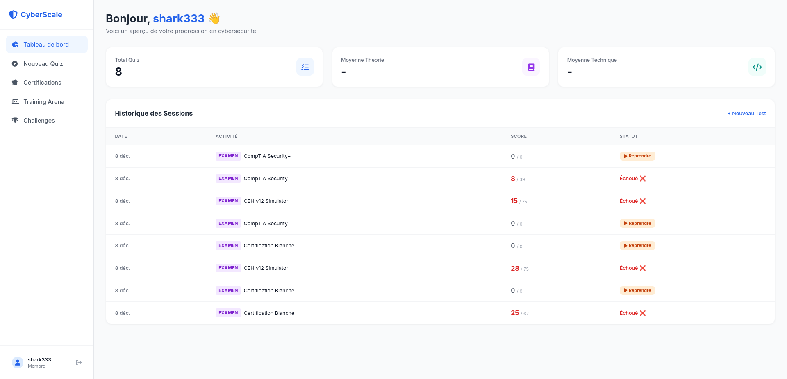

# 🛡️ CyberScale v2.0.0

<p align="center">
  
</p>

<p align="center">
  
  
  
  
</p>

---

## 🌟 La Plateforme Cyber "All-in-One"

**CyberScale** est une plateforme immersive de formation à la cybersécurité. Conçue pour les ingénieurs DevOps et les analystes SOC, elle fusionne **Infrastructure éphémère**, **Analyse de logs par IA** et **Entraînement offensif**.

### 🚀 Nouveautés de la v2.0.0
- **Auto-Scale Infrastructure** : Déploiement dynamique de topologies complexes.
- **Enhanced Cyber Arena** : Terminaux isolés avec persistence de session.
- **AI Intelligence Layer** : Génération de scénarios d'attaque réalistes via modèles de langage.
- **Fixes & Security** : Correction des permissions critiques et isolation des workspaces.

---

## 🎮 Modules Principaux

### 🔴 Red Team : Cyber Arena
Un environnement de terminal Linux réel (Kali, Ubuntu, Alpine) orchestré via Docker.
- **Isolation Totale** : Chaque utilisateur dispose de son propre namespace.
- **Système de Flags** : Validation CTF intégrée.
- **Architecture DooD** : Docker-out-of-Docker pour une gestion native des conteneurs.

### 🔵 Blue Team : Investigation & Logs
Devenez analyste SOC en traitant des incidents générés en temps réel.
- **Analyse SIEM** : Détection de patterns (SQLi, Brute-force).
- **Honeypot Deployment** : Déployez des leurres Kubernetes en un clic.

### 🧠 Intelligence & Certifs
- **Simulateur de Phishing** : Apprenez à déjouer l'ingénierie sociale.
- **Parcours de Certification** : Préparation CEH & CompTIA avec feedback immédiat.

---

## 🛠️ Stack Technique

| Technologie | Usage |
| :--- | :--- |
| **Java 21 / Spring Boot 3** | Backend Robuste & API REST |
| **Docker & Docker Compose** | Orchestration des Labs |
| **RabbitMQ** | Bus d'événements asynchrones |
| **PostgreSQL** | Persistance des données |
| **Vanilla JS / CSS** | Frontend ultra-rapide & Réactif |
| **JUnit 5 / JaCoCo** | Qualité de code & Tests |

---

## 🚀 Installation Express

```bash
# 1. Cloner le projet
git clone https://github.com/LyesSEHILA/DataScale.git
cd DataScale

# 2. Lancer l'infrastructure (Docker requis)
docker-compose up --build -d

# 3. Accéder à l'interface
# Ouvrez frontend/index.html (via Live Server recommandé)
```

---

## 🧪 Tests & Qualité

Nous maintenons un haut standard de qualité avec une couverture de tests automatisés.

```bash
cd backend
./gradlew clean test
```

---

### 👨‍💻 L'Équipe DevOps
- **Lyes SEHILA** - Architecte Infrastructure
- **Hassan Jatta** - Backend Expert
- **Abdoulaye** - Frontend Designer

---
<p align="center">Made with ❤️ for the Cybersecurity Community</p>
