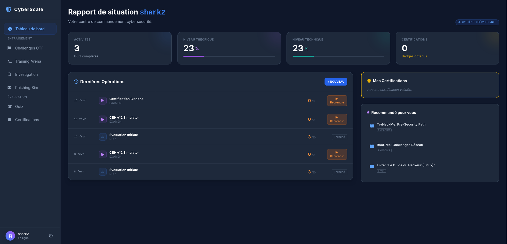

# 🛡️ CyberScale v2.0.0
<p align="center">
  
</p>

<p align="center">
  <!-- Version & Build -->
  <a href="https://github.com/LyesSEHILA/DataScale/releases"></a>
  <a href="https://github.com/LyesSEHILA/DataScale/actions/workflows/ci.yml"></a>
  <a href="https://sonarcloud.io/dashboard?id=LyesSEHILA_DataScale"></a>
  
</p>

<p align="center">
  <!-- Stack -->
  
  
  
  
</p>

<p align="center">
  <!-- Database & Messaging -->
  
  
  
</p>

<p align="center">
  <!-- Quality & Testing -->
  
  
  
  
</p>

<p align="center">
  <!-- Security & Domain -->
  
  
  
  
</p>

<p align="center">
  <!-- AI & Platform -->
  
  
  
  
</p>

<p align="center">
  <!-- Certifications -->
  
  
</p>

<p align="center">
  <!-- Community & Contribution -->
  
  
  
</p>


---

## 🌟 La Plateforme Cyber "All-in-One"

**CyberScale** est une plateforme immersive de formation à la cybersécurité. Conçue pour les ingénieurs DevOps et les analystes SOC, elle fusionne **Infrastructure éphémère**, **Analyse de logs par IA** et **Entraînement offensif**.

### 🔥 Nouveautés de la v2.0.0
*   🚀 **Auto-Scale Infrastructure** : Déploiement dynamique de topologies réseaux complexes.
*   💻 **Enhanced Cyber Arena** : Terminaux Linux (Kali/Ubuntu) isolés orchestrés par Docker avec persistance de session.
*   🤖 **AI Intelligence Layer** : Génération de scénarios d'attaque réalistes via LLM.
*   🛡️ **Security Hardening** : Isolation stricte des workspaces et correction des permissions critiques.

---

## 🎮 Modules de Formation

### 🔴 Red Team : Cyber Arena
Environnement de terminal réel orchestré via Docker pour l'entraînement offensif.
- **Isolation Native** : Chaque utilisateur dispose de son propre namespace Linux.
- **CTF Integration** : Trouvez les flags cachés et validez-les via la commande `submit <flag>`.
- **DooD Architecture** : Utilisation du socket Docker (Docker-out-of-Docker) pour une performance native.

### 🔵 Blue Team : SOC & Investigation
Devenez analyste en traitant des incidents de sécurité générés en temps réel.
- **SIEM Simulation** : Détection de patterns (SQLi, Brute-force, XSS).
- **Honeypot Orchestrator** : Déployez des leurres Kubernetes en un clic.
- **Infrastructure Asynchrone** : RabbitMQ pour le traitement des événements en arrière-plan.

### 🧠 Academy & Phishing
- **Email Simulator** : Apprenez à déjouer l'ingénierie sociale complexe.
- **Certification Paths** : Préparation intensive CEH & CompTIA Security+.

---

## 🛠️ Stack Technique

| Composant | Technologie |
| :--- | :--- |
| **Backend** | Java 21 / Spring Boot 3.4 / JPA |
| **Infrastructure** | Docker / Kubernetes / RabbitMQ |
| **Database** | PostgreSQL / H2 (Dev) |
| **Frontend** | Vanilla JS / CSS Modern (BEM) |
| **Qualité** | JUnit 5 / JaCoCo / SonarCloud |

---

## 🚀 Installation Express

```bash
# 1. Cloner le dépôt
git clone https://github.com/LyesSEHILA/DataScale.git
cd DataScale

# 2. Lancer l'infrastructure complète
docker-compose up --build -d

# 3. Accéder à l'interface
# Ouvrez 'frontend/index.html' avec un serveur local (Live Server recommandé)
```

---

## 🧪 Qualité & Tests

Nous garantissons une stabilité maximale via une suite de tests automatisés rigoureuse.

```bash
cd backend
./gradlew clean test
```
*Le rapport de couverture est généré dans `backend/build/reports/jacoco/test/html/index.html`.*

---

### 👥 L'Équipe DevOps
- **Lyes SEHILA** - Architecte Infrastructure & Lead DevOps
- **Hassan Jatta** - Backend Expert
- **Abdoulaye** - Frontend UI/UX Designer

---
<p align="center">Made with ❤️ for the Cybersecurity Community</p>
