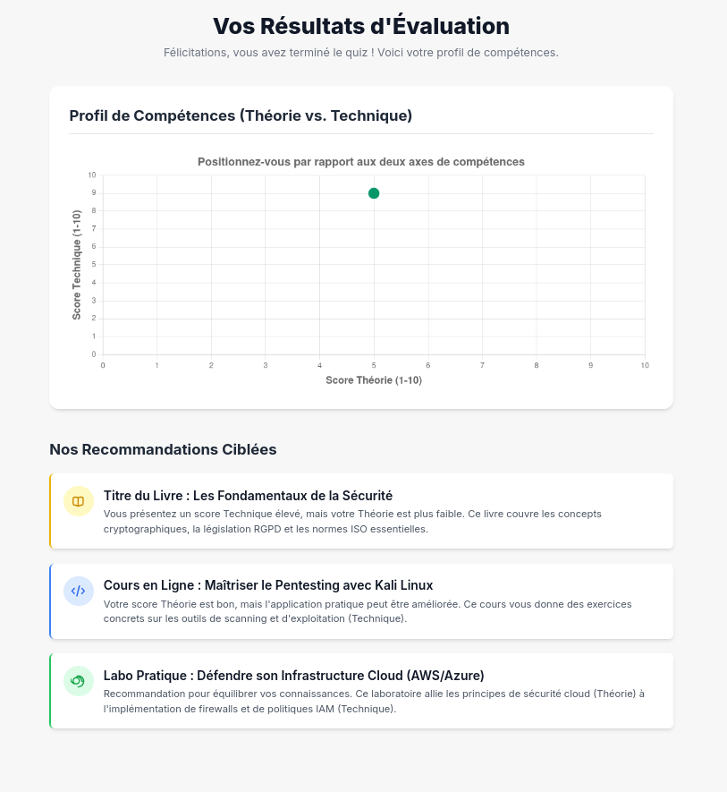
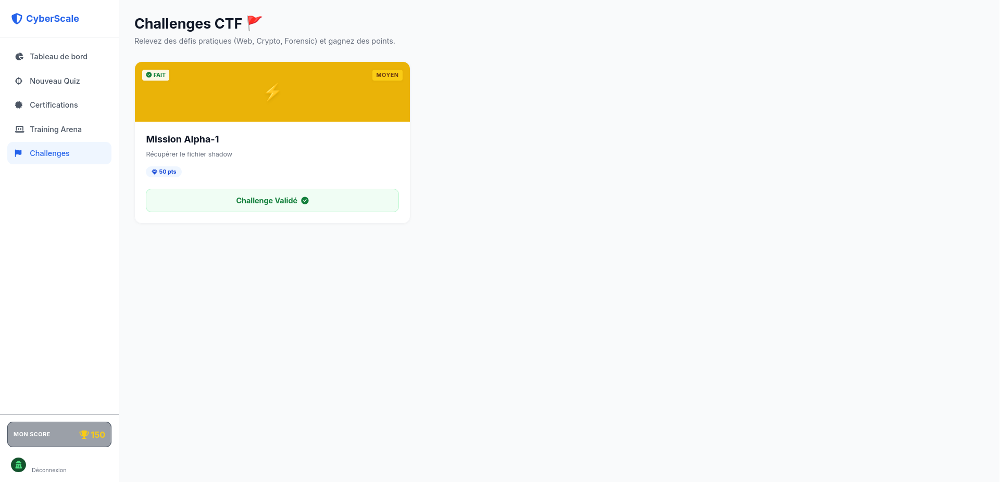
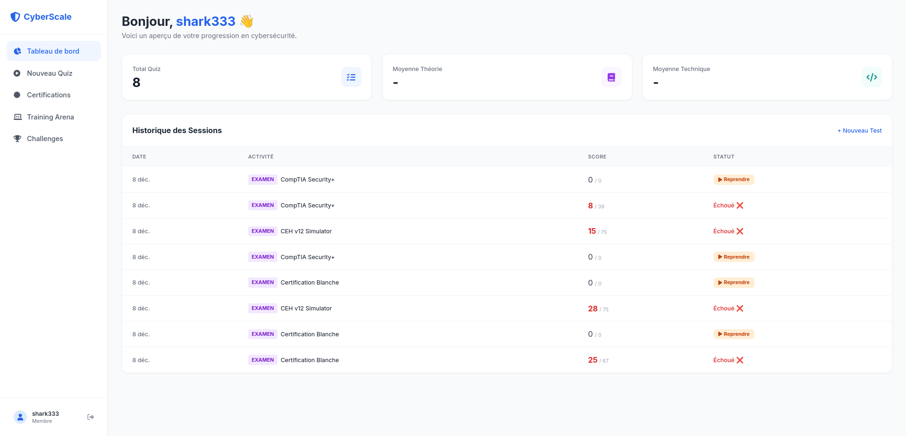

= Documentation Projet CyberScale
:toc: left
:toclevels: 3
:sectnums:
:source-highlighter: highlight.js
:icons: font
:imagesdir: ./
:experimental:

[abstract]
Documentation technique et fonctionnelle du projet CyberScale, plateforme de positionnement en cybersécurité.

== Présentation

=== L'Équipe
Projet réalisé dans le cadre du cursus DevOps par :

* *Lyes SEHILA* - Lead DevOps & Architecte
* *Hassan Jatta* - Lead Backend
* *Abdoulaye* - Lead Frontend

=== Thématique et Objectifs

CyberScale a pour mission de fournir une évaluation claire et actionnable des compétences en cybersécurité.

*.Concept Clé : La Matrice de Compétences*
Le projet repose sur la distinction entre deux axes fondamentaux :

. *L'Axe Théorique (X)* : Connaissance des concepts, normes (ISO 27001), lois (RGPD), et méthodologies.
. *L'Axe Technique (Y)* : Maîtrise des outils (Nmap, Wireshark), scripts, et procédures techniques.

*.Parcours Utilisateur*
. *Onboarding* : Saisie du profil et auto-évaluation.
. *Test Adaptatif* : Quiz intelligent qui s'adapte au niveau déclaré.
. *Résultats* : Visualisation sur un nuage de points (Scatter Plot).
. *Orientation* : Recommandations de ressources ciblées.

=== Analyse de la Concurrence

Le marché de l'évaluation en cybersécurité est dominé par deux types d'acteurs :

* *Les plateformes de challenge (CTF/Labs)* : Des sites comme *RootMe*, *TryHackMe* ou *Hack The Box* sont excellents pour mesurer les compétences **techniques** pures. Cependant, ils n'évaluent que très peu les connaissances théoriques (gouvernance, normes, lois).

* *Les Certifications* : Des examens comme *CompTIA Security+* ou *CISSP* évaluent très bien la **théorie**, mais leurs tests pratiques sont souvent limités ou très coûteux.

**Notre Positionnement :**
CyberScale se différencie en étant la seule plateforme d'auto-évaluation qui positionne explicitement l'utilisateur sur ces **deux axes** (Théorie vs. Technique). L'objectif n'est pas de remplacer les CTF ou les certifications, mais de servir d'**outil d'orientation** pour aider l'utilisateur à savoir *vers quoi* il doit se diriger.

== Architecture et Technologies

=== Architecture Système

L'application suit une architecture découplée (Client-Serveur) standard.

.Diagramme d'Architecture Système
plantuml::uml/system_architecture.puml[format=png, align="center"]

=== Stack Technique

[cols="1,3"]
|===
| Domaine | Technologies

| *Backend*
| Java 21, Spring Boot 3, Gradle, Spring Data JPA, H2 (Dev) / PostgreSQL (Prod)

| *Frontend*
| HTML5, CSS3, JavaScript (Vanilla), Chart.js (Visualisation)

| *DevOps*
| GitHub, GitHub Actions (CI/CD), SonarCloud (Qualité), Docker

| *Tests*
| JUnit 5, Mockito, MockMvc, Cucumber (BDD), Selenium (E2E)
|===

=== Modèle de Données

Le modèle métier reflète la structure du quiz et des résultats.

.Diagramme de Classe Métier
plantuml::uml/class_diagram.puml[format=png, align="center"]

== Fonctionnalités (Features)

===  F1: Onboarding & Auto-évaluation
*Objectifs*:: Permettre à un nouvel utilisateur de démarrer le processus en fournissant son âge et son auto-évaluation (Théorie/Technique).
*Scénario*:: L'utilisateur arrive sur la page d'accueil, remplit le formulaire et clique sur "Commencer". Une session unique est créée côté backend.

.Wireframe F1 - Accueil
image::wireframes/F1_Onboarding.png[width=600, align="center"]

===  F2: Moteur de Quiz Adaptatif
*Objectifs*:: Générer et présenter une série de questions pertinentes. La difficulté et la catégorie (Théorie/Technique) sont pondérées selon l'auto-évaluation.
*Scénario*:: L'utilisateur voit une question, choisit une réponse, valide, et passe à la suivante automatiquement.

.Wireframe F2 - Quiz
image::wireframes/F2_Quiz.png[width=600, align="center"]

=== F3: Visualisation des Résultats
*Objectifs*:: Calculer les scores finaux et les afficher visuellement sur un graphique 2D.
*Scénario*:: À la fin du quiz, l'utilisateur découvre son positionnement précis sur la matrice "Théorie vs Technique".

.Wireframe F3 - Résultats

=== F4: Système de Recommandations
*Objectifs*:: Proposer une liste de ressources ciblées (livres, certs, exercices) en fonction du quadrant où l'utilisateur a atterri.
*Scénario*:: Sous le graphique, des cartes cliquables proposent des contenus pour s'améliorer (ex: "Vos bases techniques sont faibles ? Essayez TryHackMe").

== 🚀 Release v0.2.0 : Fonctionnalités & Architecture

Cette version majeure transforme l'application en une plateforme d'entraînement complète. Voici le détail des implémentations.

=== Sécurité & Authentification 🔐
Un système complet de gestion des utilisateurs a été mis en place pour sécuriser l'accès à la plateforme.
* **Inscription & Connexion :** Formulaires sécurisés avec gestion des erreurs.
* **Sécurisation des mots de passe :** Hachage via Spring Security avant stockage en base de données.
* **Protection des Routes (AuthGuard) :** Mécanisme Frontend empêchant l'accès aux pages sensibles (Dashboard, Arena) sans session active.
* **Persistance de Session :** Utilisation du `localStorage` pour maintenir l'utilisateur connecté.

=== Cyber Arena (Terminal Web) 💻
L'Arena est un environnement de simulation Linux interactif intégré directement dans le navigateur.
* **Technologie :** Basé sur la librairie **Xterm.js**.
* **Système de Fichiers Virtuel :** Simulation d'une arborescence (`/home`, fichiers de config, secrets).
* **Commandes Implémentées :**
** `ls` : Lister les fichiers (avec coloration syntaxique).
** `cat` : Lire le contenu des fichiers (avec gestion des permissions).
** `sudo` : Exécuter des commandes avec privilèges élevés.
** `submit` : Soumettre un flag pour validation auprès de l'API.

.Interface du Terminal Web
image::images/terminal.png[Terminal Arena, 600, align="center"]

=== Système "Capture The Flag" (CTF) 🚩
Un moteur de jeu a été développé pour rendre l'apprentissage ludique.
* **Scénarios :** Défis techniques (ex: "Mission Alpha-1") avec narration.
* **Validation de Flag :** API Backend dédiée pour vérifier les réponses (`CTF{...}`).
* **Récompenses :** Attribution automatique de points en cas de succès.
* **Prévention de la triche :** Un défi ne peut être validé qu'une seule fois par utilisateur.

.Tableau de bord des Challenges

=== Mode Certification & Examens 🎓
Préparation aux certifications réelles avec des conditions d'examen.
* **Simulateurs :** Support des examens **CEH**, **CISSP** et **CompTIA Security+**.
* **Algorithme Prédictif :** Calcul de la probabilité de réussite à l'examen officiel basé sur le score obtenu.
* **Gestion du Temps :** Minuterie stricte (ex: 30 minutes) avec soumission automatique à la fin.

=== Gamification & Suivi 🏆
Pour engager les utilisateurs, des éléments de jeu ont été intégrés.
* **Score Global :** Affichage du score cumulé en temps réel sur le Dashboard.
* **Badges de Difficulté :** Indicateurs visuels (Facile, Moyen, Hardcore) sur les cartes de défis.
* **Feedback Visuel :** Animations et messages de succès lors de la réussite d'un défi.

.Affichage du Score Utilisateur

=== Qualité Technique & Tests ⚙️
Le projet respecte les standards de développement professionnels.
* **Architecture Backend :** Séparation claire en contrôleurs, services, repositories et DTOs.
* **Tests Unitaires :** Couverture complète des services (JUnit 5, Mockito).
* **Tests d'Intégration :** Validation des endpoints API avec MockMvc et base de données H2.
* **Tests E2E (End-to-End) :** Scénarios utilisateurs automatisés avec **Selenium** (ex: Parcours complet Login -> Arena -> Submit Flag).