= Documentation Projet CyberScale v1.0.0
:toc: left
:toclevels: 3
:sectnums:
:source-highlighter: highlight.js
:icons: font
:imagesdir: ./
:experimental:

[abstract]
Documentation technique et fonctionnelle de la plateforme CyberScale. Cette version v1.0.0 marque l'aboutissement du projet avec une architecture conteneurisée complète, des modules d'attaque et de défense, et un tableau de bord unifié.

== Présentation

=== L'Équipe
Projet réalisé dans le cadre du cursus DevOps par :

* *Lyes SEHILA* - Lead DevOps & Architecte
* *Hassan Jatta* - Lead Backend
* *Abdoulaye* - Lead Frontend

=== Vision et Objectifs

CyberScale a pour mission de fournir une évaluation "360 degrés" des compétences en cybersécurité.

*.Concept Clé : La Matrice de Compétences*

Nous positionnons l'utilisateur sur deux axes complémentaires :

. *L'Axe Théorique (X)* : Maîtrise des concepts, normes (ISO 27001), et lois (RGPD).
. *L'Axe Technique (Y)* : Capacité opérationnelle (Pentest, Scripting, Analyse de logs).

=== Analyse de la Concurrence

Le marché est polarisé :

* *CTF (RootMe)* : Excellent pour la technique pure, mais austère et sans théorie.
* *Certifications (CISSP)* : Très théoriques, coûteuses, sans pratique immédiate.

**CyberScale** réunit ces deux mondes : nous ne formons pas que des hackers, mais des professionnels complets (Red Team & Blue Team).

== Architecture et Technique

=== Architecture Détaillée

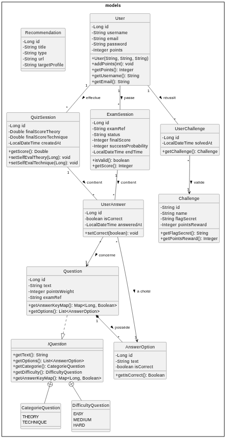

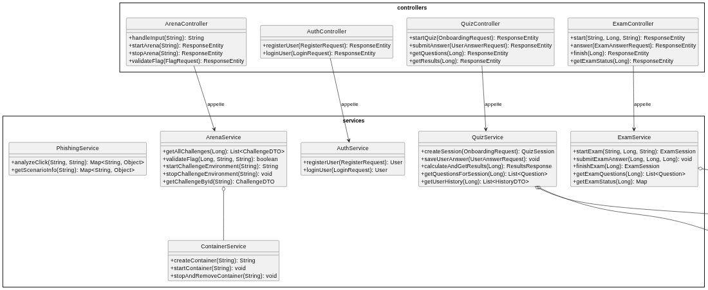

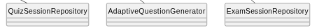

Pour garantir une meilleure lisibilité, l'architecture est présentée en deux vues distinctes.

==== Vue Logique : Traitement & Services
Ce diagramme illustre la couche "Intelligente" de CyberScale. On y voit comment les Contrôleurs (API) orchestrent les Services métiers. Notez particulièrement l'interaction entre `ArenaController` et le `ContainerService` (gestion Docker), ainsi que le générateur de logs pour la Blue Team.

.Architecture Logique (Contrôleurs & Services)
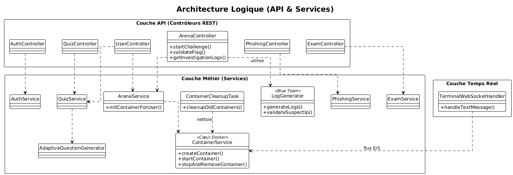

==== Vue de Données : Persistance
Ce diagramme présente la structure de la base de données PostgreSQL (Entités JPA). Il met en évidence la centralisation des données autour de l'entité `User`, qui est liée à ses résultats de quiz, ses challenges réussis et ses examens.

.Modèle de Données (Entités JPA)
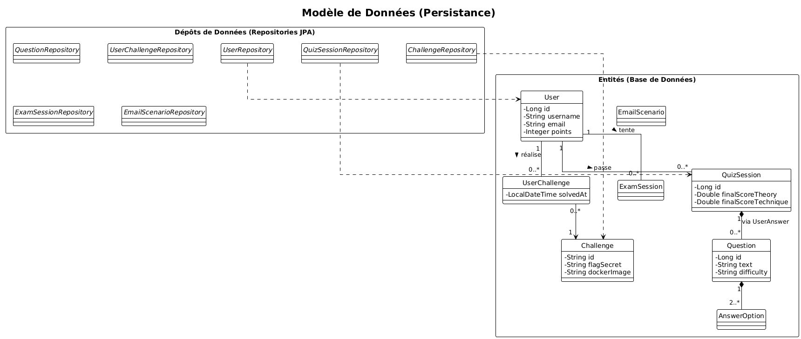

=== Stack Technique

[cols="1,3"]
|===
| Domaine | Technologies

| *Backend*
| Java 21, Spring Boot 3 (Security, JPA, WebSocket)

| *Données*
| PostgreSQL 16 (Production)

| *Frontend*
| HTML5, CSS3, JavaScript (Vanilla), Xterm.js (Terminal Web)

| *DevOps*
| Docker, Docker Compose, GitHub Actions (CI/CD), SonarCloud

| *Tests*
| JUnit 5, Selenium (E2E), Cucumber (BDD)
|===

=== Focus : La Dockerisation (Cœur du Projet)

C'est l'innovation technique majeure de cette release. Pour permettre aux utilisateurs de s'entraîner sans risque, nous avons développé un orchestrateur de conteneurs interne.

* **Isolation Totale :** Chaque challenge technique lance un conteneur Docker dédié à l'utilisateur. Il est impossible d'impacter le serveur hôte.
* **Gestion du Cycle de Vie :**
** *Création* : Instanciation à la volée via l'API `docker-java` lors du clic sur "Démarrer".
** *Communication* : Un tunnel **WebSocket** relie le terminal Web (`Xterm.js`) à l'entrée/sortie standard du conteneur Linux.
** *Nettoyage* : Une tâche planifiée (`ContainerCleanupTask`) détruit automatiquement les conteneurs inactifs ou terminés pour libérer les ressources.
* **Sécurité :** Les conteneurs sont éphémères et n'ont aucun accès réseau vers l'extérieur (sauf si nécessaire pour le scénario).

.Fonctionnement de l'architecture dockerisé
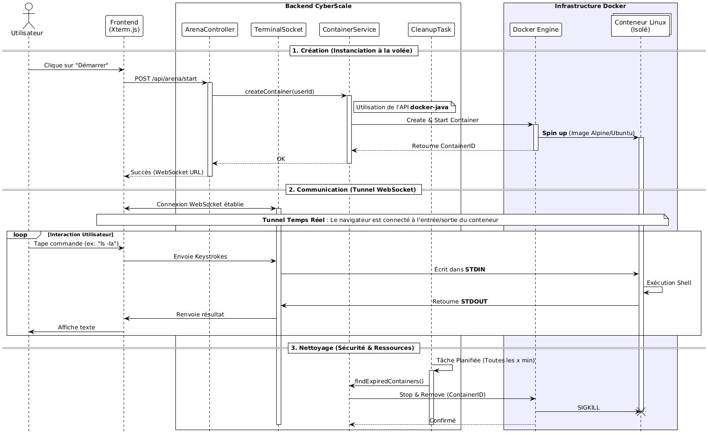

== Utilisation de l'IA Générative

Dans une démarche de transparence et d'optimisation du temps de développement, nous avons utilisé des outils d'Intelligence Artificielle (type LLM) pour des tâches d'assistance spécifiques, sans leur déléguer l'architecture cœur du projet.

* **Génération de Jeux de Données (Data Seeding)** :
Pour le module d'Investigation (Blue Team), il était nécessaire de créer des milliers de lignes de logs réalistes (Apache/Linux). L'IA a été utilisée pour générer ces motifs de logs et y insérer des scénarios d'attaques variés, une tâche trop répétitive pour être faite manuellement.

* **Création de Contenu Pédagogique** :
Afin de peupler la base de données du Quiz, l'IA nous a assistés dans la rédaction des questions et des explications associées, nous permettant de nous concentrer sur l'algorithme de pondération plutôt que sur la rédaction.

* **Aide au Débogage Docker** :
Lors de la configuration complexe des conteneurs isolés pour l'Arena, l'IA a servi d'assistant pour analyser certaines erreurs obscures liées aux permissions Linux et aux WebSockets.

== Fonctionnalités (Features v1.0.0)

Cette version finale intègre l'ensemble des modules prévus.

=== F1: Onboarding & Quiz Adaptatif 
*Objectif*:: Évaluer le bagage théorique initial.
*Innovation*:: L'algorithme adapte la difficulté des questions (Facile -> Moyen -> Difficile) en fonction des réponses précédentes pour affiner le score.

.Wireframe Quiz
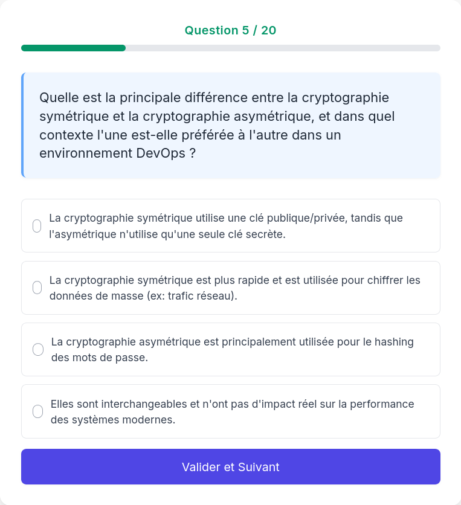

=== F2: Cyber Arena (Red Team) 
*Objectif*:: Tester les compétences offensives (Linux, Pentest).
*Scénario*:: L'utilisateur accède à un vrai terminal Linux. Il doit naviguer, décoder des fichiers et exploiter des failles pour trouver des "flags" (`CTF{...}`).
*Validation*:: Le flag est validé par un script interne au conteneur qui notifie le backend en temps réel.

.Interface du Terminal Web
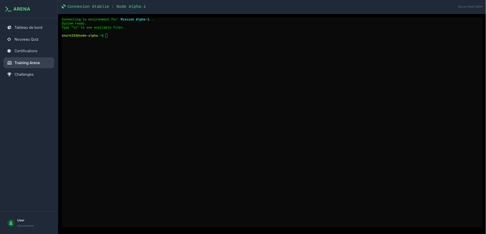

=== F3: Module Phishing (Facteur Humain) 
*Objectif*:: Tester la vigilance face à l'ingénierie sociale.
*Fonctionnement*:: Simulation d'une boîte mail avec des courriels piégés (Urgence RH, Faux support). L'utilisateur doit analyser les en-têtes et décider de signaler ou cliquer.

.Interface de Phishing
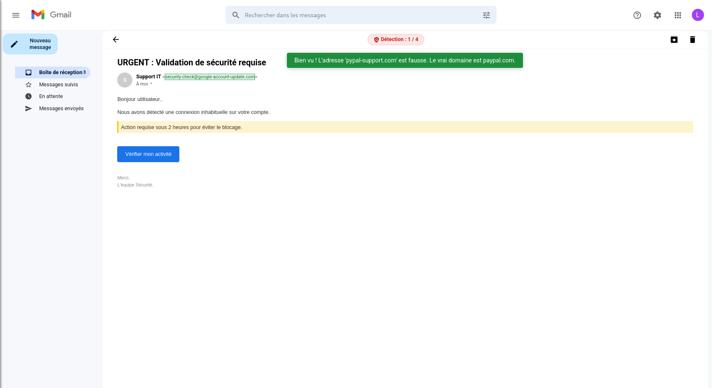

.Phishing Réussi
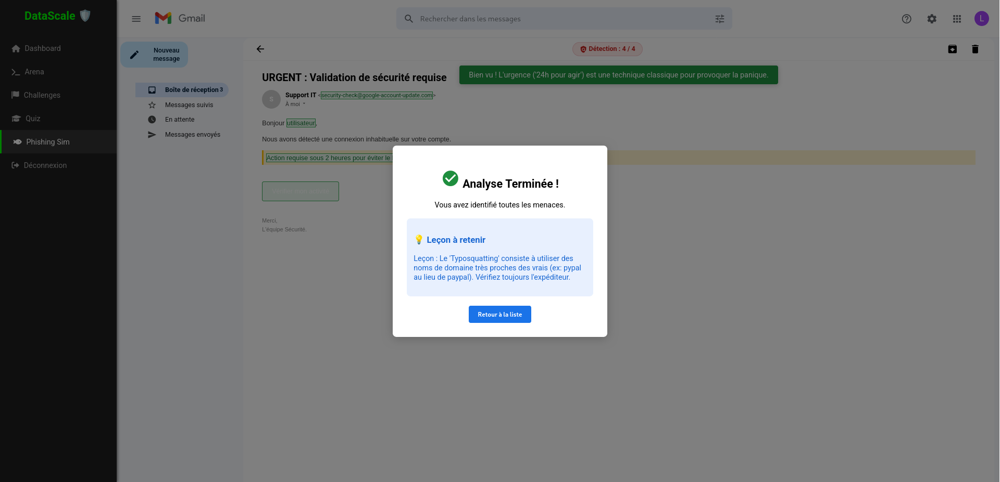

=== F4: Module Investigation (Blue Team) 
*Objectif*:: Former à la défense et à l'analyse de logs (Forensics).
*Technique*:: Un générateur de logs (`LogGenerator`) crée dynamiquement des milliers de lignes de trafic web réaliste, en y cachant une attaque unique (ex: Injection SQL). L'utilisateur doit filtrer et identifier l'IP malveillante.

.Accueil dans le menu d'Investigation
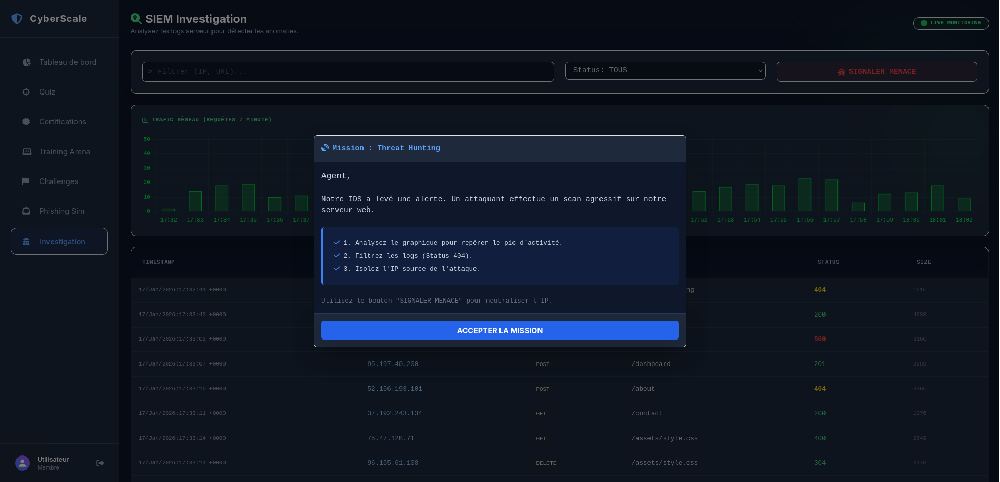

.Affichage des Logs
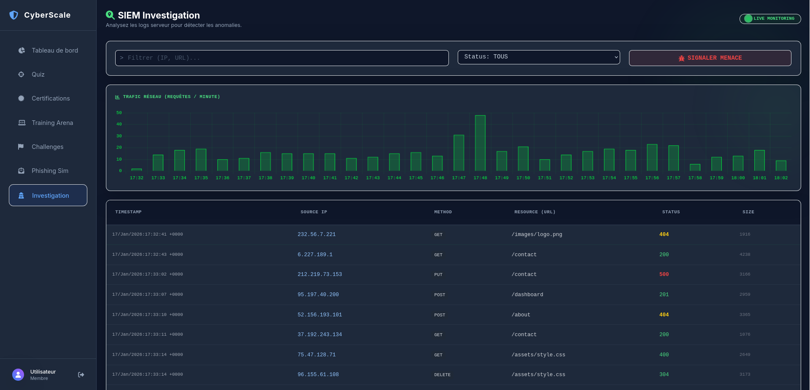

=== F5: Dashboard Unifié & Certification 
*Objectif*:: Centraliser la progression.
*Évolution v1.0*:: Le Dashboard agrège désormais les scores de tous les modules (Quiz + Arena + Logs + Phishing) pour calculer une moyenne globale.
*Recommandations*:: Si le score est faible, le système suggère des ressources externes ciblées. Si le score est élevé (>80%), il débloque des certifications virtuelles.

.Tableau de Bord Global
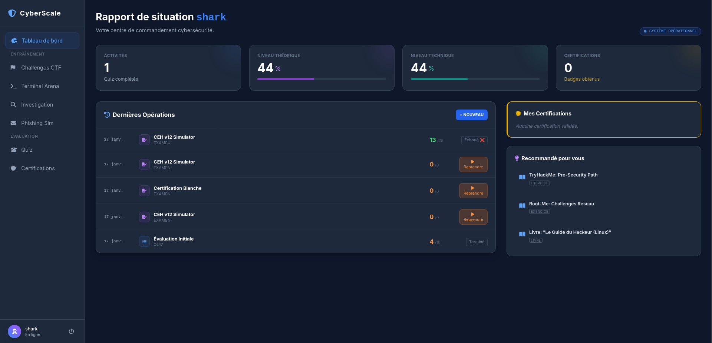

== Gestion de Projet & Qualité 

=== Sécurité & Authentification
L'accès est strictement contrôlé pour protéger la progression des utilisateurs.

* **Inscription & Connexion :** Formulaires sécurisés avec gestion des erreurs (401/403).
* **Sécurisation des mots de passe :** Hachage robuste via Spring Security (BCrypt) avant stockage en base.
* **Protection des Routes (AuthGuard) :** Mécanisme Frontend empêchant l'accès direct aux pages sensibles (Dashboard, Arena) sans token de session valide.
* **Persistance :** Utilisation du `localStorage` pour une expérience utilisateur fluide.

=== Qualité du Code (CI/CD)
Nous avons industrialisé notre processus de développement pour la v1.0.

* **Pipeline Automatisé :** Chaque modification du code déclenche une compilation et des tests via GitHub Actions.
* **Tests Unitaires (JUnit) :** Couverture de la logique métier critique (Calcul de score, Génération de logs).
* **Tests E2E (Selenium) :** Validation automatique des parcours utilisateurs complets (Login -> Arena -> Fin).
* **Analyse Statique :** Zéro "Security Hotspot" critique sur SonarCloud.

== Conclusion & Perspectives 
La version v1.0.0 de CyberScale est une plateforme complète et innovante pour l'évaluation des compétences en cybersécurité. En combinant théorie, pratique, et une architecture technique avancée, nous offrons une expérience utilisateur unique.
