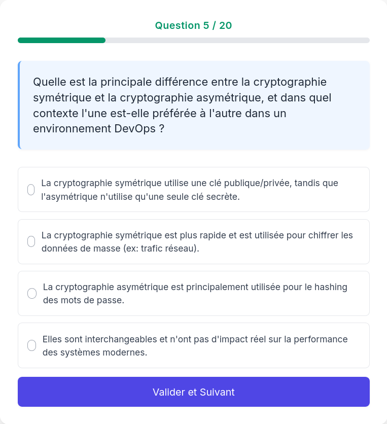
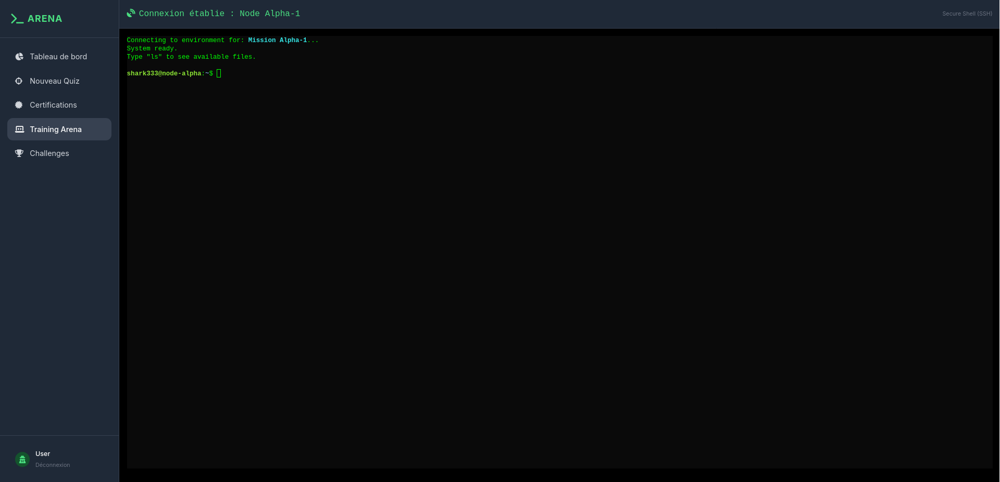

= Documentation Projet CyberScale v1.0.1
:toc: left
:toclevels: 3
:sectnums:
:source-highlighter: highlight.js
:icons: font
:imagesdir: ./
:experimental:

[abstract]
Documentation technique et fonctionnelle de la plateforme CyberScale. Cette version v1.0.1 apporte une stabilisation de l'infrastructure avec l'intégration de RabbitMQ pour l'asynchronisme et une meilleure orchestration Docker/Kubernetes.

== Présentation

=== L'Équipe
Projet réalisé dans le cadre du cursus DevOps par :

* *Lyes SEHILA* - Lead DevOps & Architecte
* *Hassan Jatta* - Lead Backend
* *Abdoulaye* - Lead Frontend

=== Vision et Objectifs (v1.0.1)

CyberScale a pour mission de fournir une évaluation "360 degrés" des compétences en cybersécurité. La version v1.0.1 met l'accent sur la résilience et la scalabilité de l'infrastructure.

== Architecture et Technique

=== Architecture Détaillée (v1.0.1)

Pour garantir une meilleure lisibilité, l'architecture est présentée en trois vues distinctes.

==== Vue Infrastructure : Orchestration & Messages (Nouveau)
Ce diagramme illustre le flux de données entre le frontend, le backend et les services d'infrastructure (RabbitMQ, Docker, Kubernetes). 

* **RabbitMQ** : Gère les files d'attente pour l'exécution asynchrone des commandes.
* **Kubernetes** : Utilisé pour le déploiement dynamique de leurres (honeypots).

.Architecture Technique Globale (v1.0.1)
[plantuml, architecture_v1_0_1, png]
....
include::uml/architecture_v1_0_1.puml[]
....

==== Vue Logique : Traitement & Services
Ce diagramme illustre la couche "Intelligente" de CyberScale. On y voit comment les Contrôleurs (API) orchestrent les Services métiers. Notez particulièrement l'interaction entre `ArenaController` et le `ContainerService` (gestion Docker), ainsi que le générateur de logs pour la Blue Team.

==== Vue de Données : Persistance
Ce diagramme présente la structure de la base de données PostgreSQL (Entités JPA). Il met en évidence la centralisation des données autour de l'entité `User`, qui est liée à ses résultats de quiz, ses challenges réussis et ses examens.

=== Stack Technique

[cols="1,3"]
|===
| Domaine | Technologies

| *Backend*
| Java 21, Spring Boot 3.4.11 (Security, JPA, WebSocket)

| *Données*
| PostgreSQL 16 (Production), H2 (Développement)

| *Messaging*
| **RabbitMQ 3** (Management)

| *Orchestration*
| **Docker Engine**, **Kubernetes** (Honeypots)

| *Frontend*
| HTML5, CSS3, JavaScript (Vanilla), Tailwind CSS, Xterm.js

| *DevOps*
| GitHub Actions (CI/CD), SonarCloud, JaCoCo

| *Tests*
| JUnit 5, Selenium (E2E), Cucumber (BDD), Mockito
|===

=== Focus : La Dockerisation & Flags Dynamiques

C'est l'innovation technique majeure de cette release. Pour permettre aux utilisateurs de s'entraîner sans risque, nous avons développé un orchestrateur de conteneurs interne.

* **Flags Dynamiques :** Contrairement à la v1.0.0, chaque conteneur possède désormais un flag unique généré à la volée (`CHALLENGE_FLAG`), empêchant le partage de solutions.
* **Isolation Totale :** Chaque challenge technique lance un conteneur Docker dédié à l'utilisateur.
* **Communication :** Un tunnel **WebSocket** relie le terminal Web (`Xterm.js`) à l'entrée/sortie standard du conteneur via RabbitMQ pour une exécution robuste.

.Fonctionnement de l'architecture dockerisé
image::images/docker[Docker, 600, align="center"]

== Utilisation de l'IA Générative

Dans une démarche de transparence et d'optimisation du temps de développement, nous avons utilisé des outils d'Intelligence Artificielle (type LLM) pour des tâches d'assistance spécifiques, sans leur déléguer l'architecture cœur du projet.

* **Génération de Jeux de Données (Data Seeding)** :
Pour le module d'Investigation (Blue Team), il était nécessaire de créer des milliers de lignes de logs réalistes (Apache/Linux). L'IA a été utilisée pour générer ces motifs de logs et y insérer des scénarios d'attaques variés, une tâche trop répétitive pour être faite manuellement.

* **Création de Contenu Pédagogique** :
Afin de peupler la base de données du Quiz, l'IA nous a assistés dans la rédaction des questions et des explications associées, nous permettant de nous concentrer sur l'algorithme de pondération plutôt que sur la rédaction.

* **Aide au Débogage Docker** :
Lors de la configuration complexe des conteneurs isolés pour l'Arena, l'IA a servi d'assistant pour analyser certaines erreurs obscures liées aux permissions Linux et aux WebSockets.

== Fonctionnalités (Features v1.0.1)

Cette version apporte des améliorations majeures sur l'infrastructure et la sécurité des épreuves.

=== F1: Onboarding & Quiz Adaptatif 
*Objectif*:: Évaluer le bagage théorique initial.
*Innovation*:: L'algorithme adapte la difficulté des questions (Facile -> Moyen -> Difficile) en fonction des réponses précédentes pour affiner le score.

.Wireframe Quiz

=== F2: Cyber Arena (Red Team) - *Amélioré v1.0.1*
*Objectif*:: Tester les compétences offensives (Linux, Pentest).
*Scénario*:: L'utilisateur accède à un vrai terminal Linux isolé par Docker.
*Nouveauté v1.0.1*:: **Flags Dynamiques**. Le flag est désormais généré à la volée (`CHALLENGE_FLAG`) et stocké temporairement en mémoire pour l'utilisateur, empêchant toute triche par partage de solutions.

.Interface du Terminal Web

=== F3: Module Phishing (Facteur Humain) 
*Objectif*:: Tester la vigilance face à l'ingénierie sociale.
*Fonctionnement*:: Simulation d'une boîte mail avec des courriels piégés (Urgence RH, Faux support). L'utilisateur doit analyser les en-têtes et décider de signaler ou cliquer.

=== F4: Module Investigation (Blue Team) 
*Objectif*:: Former à la défense et à l'analyse de logs (Forensics).
*Technique*:: Un générateur de logs (`LogGenerator`) crée dynamiquement des milliers de lignes de trafic web réaliste.

=== F5: Dashboard Unifié & Certification 
*Objectif*:: Centraliser la progression.
*Évolution*:: Agrégation des scores de tous les modules pour calculer une moyenne globale et débloquer des certifications.

=== F6: Asynchronisme & Robustesse (RabbitMQ) - *Nouveau v1.0.1*
*Objectif*:: Assurer une exécution fluide et scalable des commandes.
*Technique*:: Utilisation de **RabbitMQ** pour traiter les événements de jeu et les commandes de l'Arena de manière asynchrone, évitant les blocages du thread principal.

=== F7: Défense Active & Leurres (Kubernetes) - *Nouveau v1.0.1*
*Objectif*:: Simuler des environnements de défense réseau complexes.
*Innovation*:: Intégration de **KubernetesService** pour le déploiement automatique de leurres (honeypots) en réponse à des menaces détectées.

== Gestion de Projet & Qualité 

=== Sécurité & Authentification
L'accès est strictement contrôlé pour protéger la progression des utilisateurs.

* **Inscription & Connexion :** Formulaires sécurisés avec gestion des erreurs (401/403).
* **Sécurisation des mots de passe :** Hachage robuste via Spring Security (BCrypt) avant stockage en base.
* **Protection des Routes (AuthGuard) :** Mécanisme Frontend empêchant l'accès direct aux pages sensibles (Dashboard, Arena) sans token de session valide.
* **Persistance :** Utilisation du `localStorage` pour une expérience utilisateur fluide.

=== Qualité du Code (CI/CD)
Nous avons industrialisé notre processus de développement pour la v1.0.

* **Pipeline Automatisé :** Chaque modification du code déclenche une compilation et des tests via GitHub Actions.
* **Tests Unitaires (JUnit) :** Couverture de la logique métier critique (Calcul de score, Génération de logs).
* **Tests E2E (Selenium) :** Validation automatique des parcours utilisateurs complets (Login -> Arena -> Fin).
* **Analyse Statique :** Zéro "Security Hotspot" critique sur SonarCloud.

== Conclusion & Perspectives 
La version v1.0.0 de CyberScale est une plateforme complète et innovante pour l'évaluation des compétences en cybersécurité. En combinant théorie, pratique, et une architecture technique avancée, nous offrons une expérience utilisateur unique.